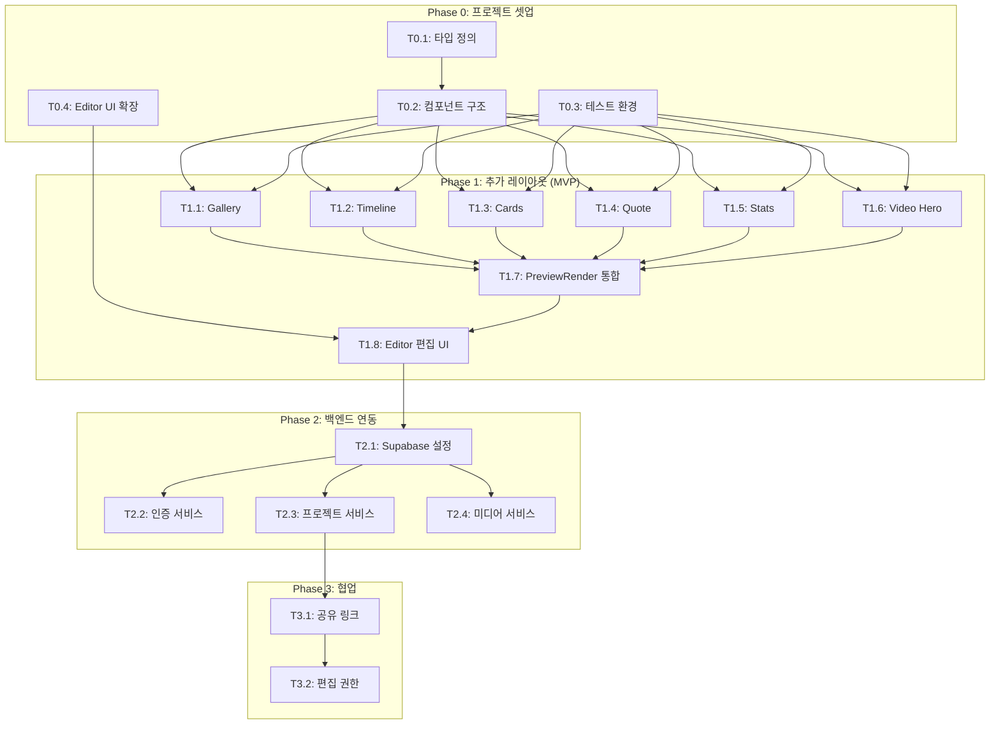

# TASKS: StoryFlow Creator 확장 - AI 개발 파트너용 태스크 목록

## MVP 캡슐

1. **목표**: 노코드 스토리텔링 페이지 빌더 기능 확장
2. **페르소나**: 프리랜서, 소상공인
3. **핵심 사용 시나리오**: 서비스 홈페이지, 포트폴리오, 이벤트 홍보 페이지 제작
4. **MVP 핵심 기능**: 추가 레이아웃 6종 (Gallery, Timeline, Cards, Quote, Stats, Video Hero)
5. **성공 지표**: 코딩 모르는 사람 30분 내 페이지 완성, 10명+ 사용자 만족
6. **기술 스택**: React 19 + TypeScript + Vite 6 + Tailwind CSS + Supabase
7. **안티패턴**: 복잡함 피하기 - "누구나 쉽게 단숨에 이해"
8. **디자인 레퍼런스**: suzag.com (스크롤), Canva (드래그앤드롭)
9. **제약**: 1인 개발, 버그 최소화 중요
10. **다음 단계**: Phase 1 완료 후 → Phase 2 백엔드 연동

---

## 마일스톤 개요

| 마일스톤 | Phase | 설명 | 주요 기능 |
|----------|-------|------|----------|
| M0 | Phase 0 | 프로젝트 셋업 | 타입 확장, 컴포넌트 구조, 테스트 환경 |
| M1 | Phase 1 | 추가 레이아웃 (MVP) | 6종 레이아웃 구현 |
| M2 | Phase 2 | 백엔드 연동 | Supabase, 인증, 클라우드 저장 |
| M3 | Phase 3 | 협업 기능 | 공유, 편집 권한 |

---

## M0: 프로젝트 셋업

### [] Phase 0, T0.1: 타입 정의 확장

**담당**: frontend-specialist

**작업 내용**:
- `types.ts`에 신규 레이아웃 타입 추가
- 레이아웃별 데이터 인터페이스 정의

**산출물**:
- `types.ts` (확장)

**코드 예시**:
```typescript
// types.ts에 추가
enum LayoutType {
  // 기존...
  GALLERY = 'gallery',
  TIMELINE = 'timeline',
  CARDS = 'cards',
  QUOTE = 'quote',
  STATS = 'stats',
  VIDEO_HERO = 'video_hero',
}

interface GalleryImage {
  id: string;
  url: string;
  caption?: string;
}

interface TimelineItem {
  id: string;
  date: string;
  title: string;
  description: string;
  imageUrl?: string;
}

interface CardItem {
  id: string;
  title: string;
  description: string;
  imageUrl?: string;
  link?: string;
}

interface StatItem {
  id: string;
  value: string;
  label: string;
  icon?: string;
}
```

**완료 조건**:
- [ ] 6종 레이아웃 타입 추가됨
- [ ] 레이아웃별 데이터 인터페이스 정의됨
- [ ] TypeScript 컴파일 에러 없음 (`npx tsc --noEmit`)

---

### [] Phase 0, T0.2: 컴포넌트 구조 생성

**담당**: frontend-specialist

**작업 내용**:
- `components/layouts/` 디렉토리 생성
- 레이아웃별 빈 컴포넌트 파일 생성

**산출물**:
```
components/layouts/
├── index.ts
├── GalleryLayout.tsx
├── TimelineLayout.tsx
├── CardsLayout.tsx
├── QuoteLayout.tsx
├── StatsLayout.tsx
└── VideoHeroLayout.tsx
```

**완료 조건**:
- [ ] 6개 레이아웃 컴포넌트 파일 생성
- [ ] index.ts에서 모두 export
- [ ] 빈 컴포넌트로 TypeScript 에러 없음

---

### [] Phase 0, T0.3: 테스트 환경 구성

**담당**: frontend-specialist

**작업 내용**:
- Vitest 설치 및 설정
- 테스트 디렉토리 구조 생성
- 샘플 테스트 작성

**산출물**:
- `vitest.config.ts`
- `tests/` 디렉토리
- `tests/setup.ts`

**설치 명령어**:
```bash
npm install -D vitest @testing-library/react @testing-library/jest-dom jsdom
```

**완료 조건**:
- [ ] `npm run test` 실행 가능
- [ ] 샘플 테스트 통과

---

### [] Phase 0, T0.4: Editor 레이아웃 선택 UI 확장

**담당**: frontend-specialist

**작업 내용**:
- Editor.tsx의 레이아웃 선택 드롭다운에 6종 추가
- 레이아웃 아이콘 및 라벨 추가

**산출물**:
- `components/Editor.tsx` (수정)

**완료 조건**:
- [ ] 드롭다운에 11종 레이아웃 표시 (기존 5 + 신규 6)
- [ ] 레이아웃 선택 시 section.layout 변경됨

---

## M1: 추가 레이아웃 (MVP)

### [] Phase 1, T1.1: Gallery 레이아웃 RED→GREEN

**담당**: frontend-specialist

**Git Worktree 설정**:
```bash
# 1. Worktree 생성
git worktree add ../storyflow-phase1-gallery -b phase/1-gallery
cd ../storyflow-phase1-gallery

# 2. 작업 완료 후 병합 (사용자 승인 필요)
# git checkout main
# git merge phase/1-gallery
# git worktree remove ../storyflow-phase1-gallery
```

**TDD 사이클**:

1. **RED**: 테스트 작성 (실패 확인)
   ```bash
   # 테스트 파일: tests/layouts/GalleryLayout.test.tsx
   npm run test tests/layouts/GalleryLayout.test.tsx  # Expected: FAILED
   ```

2. **GREEN**: 최소 구현 (테스트 통과)
   ```bash
   # 구현 파일: components/layouts/GalleryLayout.tsx
   npm run test tests/layouts/GalleryLayout.test.tsx  # Expected: PASSED
   ```

3. **REFACTOR**: 리팩토링 (테스트 유지)

**기능 요구사항**:
- 2~4열 그리드 선택 가능
- 이미지 간격 조절 (gap)
- 캡션 표시 옵션
- 라이트박스 확대 (선택적)

**산출물**:
- `tests/layouts/GalleryLayout.test.tsx`
- `components/layouts/GalleryLayout.tsx`

**인수 조건**:
- [ ] 테스트 먼저 작성됨 (RED 확인)
- [ ] 모든 테스트 통과 (GREEN)
- [ ] 2~4열 그리드 렌더링
- [ ] 이미지 간격 조절 동작
- [ ] PreviewRender에서 정상 렌더링

---

### [] Phase 1, T1.2: Timeline 레이아웃 RED→GREEN

**담당**: frontend-specialist

**Git Worktree 설정**:
```bash
git worktree add ../storyflow-phase1-timeline -b phase/1-timeline
cd ../storyflow-phase1-timeline
```

**TDD 사이클**:

1. **RED**: 테스트 작성
   ```bash
   # 테스트 파일: tests/layouts/TimelineLayout.test.tsx
   npm run test tests/layouts/TimelineLayout.test.tsx
   ```

2. **GREEN**: 최소 구현
   ```bash
   # 구현 파일: components/layouts/TimelineLayout.tsx
   ```

3. **REFACTOR**: 리팩토링

**기능 요구사항**:
- 좌/우 번갈아 배치 또는 한쪽 정렬
- 날짜/제목/설명 표시
- 연결선 스타일
- 아이콘/이미지 마커

**산출물**:
- `tests/layouts/TimelineLayout.test.tsx`
- `components/layouts/TimelineLayout.tsx`

**인수 조건**:
- [ ] 테스트 먼저 작성됨 (RED 확인)
- [ ] 모든 테스트 통과 (GREEN)
- [ ] 타임라인 아이템 렌더링
- [ ] 정렬 옵션 동작
- [ ] 스크롤 애니메이션 적용

---

### [] Phase 1, T1.3: Cards 레이아웃 RED→GREEN

**담당**: frontend-specialist

**Git Worktree 설정**:
```bash
git worktree add ../storyflow-phase1-cards -b phase/1-cards
cd ../storyflow-phase1-cards
```

**TDD 사이클**:

1. **RED**: `tests/layouts/CardsLayout.test.tsx`
2. **GREEN**: `components/layouts/CardsLayout.tsx`
3. **REFACTOR**: 정리

**기능 요구사항**:
- 2~4열 카드 배치
- 카드당 이미지 + 제목 + 설명
- 호버 효과 옵션
- 둥근 모서리, 그림자 조절

**산출물**:
- `tests/layouts/CardsLayout.test.tsx`
- `components/layouts/CardsLayout.tsx`

**인수 조건**:
- [ ] 테스트 먼저 작성됨
- [ ] 모든 테스트 통과
- [ ] 카드 그리드 렌더링
- [ ] 호버 효과 동작

---

### [] Phase 1, T1.4: Quote 레이아웃 RED→GREEN

**담당**: frontend-specialist

**Git Worktree 설정**:
```bash
git worktree add ../storyflow-phase1-quote -b phase/1-quote
cd ../storyflow-phase1-quote
```

**TDD 사이클**:

1. **RED**: `tests/layouts/QuoteLayout.test.tsx`
2. **GREEN**: `components/layouts/QuoteLayout.tsx`
3. **REFACTOR**: 정리

**기능 요구사항**:
- 큰 인용 부호 장식
- 출처/저자 표시
- 배경색/이미지 선택
- 텍스트 크기 조절

**산출물**:
- `tests/layouts/QuoteLayout.test.tsx`
- `components/layouts/QuoteLayout.tsx`

**인수 조건**:
- [ ] 테스트 먼저 작성됨
- [ ] 모든 테스트 통과
- [ ] 인용문 스타일 렌더링
- [ ] 저자 표시 동작

---

### [] Phase 1, T1.5: Stats 레이아웃 RED→GREEN

**담당**: frontend-specialist

**Git Worktree 설정**:
```bash
git worktree add ../storyflow-phase1-stats -b phase/1-stats
cd ../storyflow-phase1-stats
```

**TDD 사이클**:

1. **RED**: `tests/layouts/StatsLayout.test.tsx`
2. **GREEN**: `components/layouts/StatsLayout.tsx`
3. **REFACTOR**: 정리

**기능 요구사항**:
- 2~4개 숫자 카드 배치
- 숫자 + 라벨 + 설명
- 카운트업 애니메이션 옵션
- 아이콘 추가 가능

**산출물**:
- `tests/layouts/StatsLayout.test.tsx`
- `components/layouts/StatsLayout.tsx`

**인수 조건**:
- [ ] 테스트 먼저 작성됨
- [ ] 모든 테스트 통과
- [ ] 통계 카드 렌더링
- [ ] 카운트업 애니메이션 동작

---

### [] Phase 1, T1.6: Video Hero 레이아웃 RED→GREEN

**담당**: frontend-specialist

**Git Worktree 설정**:
```bash
git worktree add ../storyflow-phase1-videohero -b phase/1-videohero
cd ../storyflow-phase1-videohero
```

**TDD 사이클**:

1. **RED**: `tests/layouts/VideoHeroLayout.test.tsx`
2. **GREEN**: `components/layouts/VideoHeroLayout.tsx`
3. **REFACTOR**: 정리

**기능 요구사항**:
- MP4/WebM 비디오 지원
- 자동 재생, 음소거, 루프
- 오버레이 + 텍스트
- 폴백 이미지 (비디오 로드 실패 시)

**산출물**:
- `tests/layouts/VideoHeroLayout.test.tsx`
- `components/layouts/VideoHeroLayout.tsx`

**인수 조건**:
- [ ] 테스트 먼저 작성됨
- [ ] 모든 테스트 통과
- [ ] 비디오 자동 재생
- [ ] 폴백 이미지 동작

---

### [] Phase 1, T1.7: PreviewRender 통합 RED→GREEN

**담당**: frontend-specialist

**의존성**: T1.1~T1.6 - **컴포넌트 import로 독립 개발 가능**

**Git Worktree 설정**:
```bash
git worktree add ../storyflow-phase1-integrate -b phase/1-integrate
cd ../storyflow-phase1-integrate
```

**TDD 사이클**:

1. **RED**: `tests/PreviewRender.test.tsx`
2. **GREEN**: `components/PreviewRender.tsx` 수정
3. **REFACTOR**: 정리

**작업 내용**:
- PreviewRender의 switch문에 6종 레이아웃 추가
- 레이아웃 컴포넌트 동적 import (코드 스플리팅)

**산출물**:
- `tests/PreviewRender.test.tsx`
- `components/PreviewRender.tsx` (수정)

**인수 조건**:
- [ ] 모든 11종 레이아웃 렌더링 테스트 통과
- [ ] 레이아웃 전환 시 정상 동작
- [ ] 번들 사이즈 최적화 (lazy import)

---

### [] Phase 1, T1.8: Editor 편집 UI 통합

**담당**: frontend-specialist

**의존성**: T0.4, T1.1~T1.6

**Git Worktree 설정**:
```bash
git worktree add ../storyflow-phase1-editor -b phase/1-editor
cd ../storyflow-phase1-editor
```

**작업 내용**:
- 레이아웃별 편집 UI 추가
- Gallery: 이미지 추가/삭제, 열 수 선택
- Timeline: 이벤트 추가/삭제, 정렬 선택
- Cards: 카드 추가/삭제, 열 수 선택
- Quote: 인용문/저자 입력
- Stats: 통계 항목 추가/삭제
- Video Hero: 비디오 업로드, 폴백 이미지

**산출물**:
- `components/Editor.tsx` (수정)
- `components/editors/` (옵션: 레이아웃별 편집 컴포넌트 분리)

**인수 조건**:
- [ ] 각 레이아웃별 편집 UI 동작
- [ ] 데이터 변경 시 실시간 프리뷰 반영
- [ ] UX: 직관적이고 복잡하지 않음

---

## M2: 백엔드 연동 (Phase 2)

### [] Phase 2, T2.1: Supabase 클라이언트 설정

**담당**: frontend-specialist

**Git Worktree 설정**:
```bash
git worktree add ../storyflow-phase2-supabase -b phase/2-supabase
cd ../storyflow-phase2-supabase
```

**작업 내용**:
- Supabase 프로젝트 생성 (수동)
- 클라이언트 라이브러리 설치
- 환경 변수 설정

**설치 명령어**:
```bash
npm install @supabase/supabase-js
```

**산출물**:
- `services/supabaseClient.ts`
- `.env.local` (Supabase URL, Anon Key)

**인수 조건**:
- [ ] Supabase 연결 테스트 통과
- [ ] 환경 변수 로드 확인

---

### [] Phase 2, T2.2: 인증 서비스 RED→GREEN

**담당**: frontend-specialist

**Git Worktree 설정**:
```bash
git worktree add ../storyflow-phase2-auth -b phase/2-auth
cd ../storyflow-phase2-auth
```

**TDD 사이클**:

1. **RED**: `tests/services/authService.test.ts`
2. **GREEN**: `services/authService.ts`
3. **REFACTOR**: 정리

**기능 요구사항**:
- Google OAuth 로그인
- 로그아웃
- 세션 유지
- useAuth 훅

**산출물**:
- `tests/services/authService.test.ts`
- `services/authService.ts`
- `hooks/useAuth.ts`

**인수 조건**:
- [ ] Google 로그인 동작
- [ ] 세션 persist 확인
- [ ] 로그아웃 동작

---

### [] Phase 2, T2.3: 프로젝트 서비스 RED→GREEN

**담당**: frontend-specialist

**Git Worktree 설정**:
```bash
git worktree add ../storyflow-phase2-project -b phase/2-project
cd ../storyflow-phase2-project
```

**TDD 사이클**:

1. **RED**: `tests/services/projectService.test.ts`
2. **GREEN**: `services/projectService.ts`
3. **REFACTOR**: 정리

**기능 요구사항**:
- 프로젝트 CRUD
- 프로젝트 목록 조회
- 자동 저장 (debounce)

**산출물**:
- `tests/services/projectService.test.ts`
- `services/projectService.ts`
- `hooks/useProject.ts`

**인수 조건**:
- [ ] 프로젝트 생성/읽기/수정/삭제 테스트 통과
- [ ] 클라우드 저장/불러오기 동작

---

### [] Phase 2, T2.4: 미디어 서비스 RED→GREEN

**담당**: frontend-specialist

**Git Worktree 설정**:
```bash
git worktree add ../storyflow-phase2-media -b phase/2-media
cd ../storyflow-phase2-media
```

**TDD 사이클**:

1. **RED**: `tests/services/mediaService.test.ts`
2. **GREEN**: `services/mediaService.ts`
3. **REFACTOR**: 정리

**기능 요구사항**:
- 이미지 업로드 (5MB 제한)
- GIF 업로드 (10MB 제한)
- 공개 URL 반환
- 업로드 진행률

**산출물**:
- `tests/services/mediaService.test.ts`
- `services/mediaService.ts`
- `hooks/useMediaUpload.ts`

**인수 조건**:
- [ ] 이미지 업로드 테스트 통과
- [ ] 파일 크기 검증 동작
- [ ] 진행률 표시 동작

---

## M3: 협업 기능 (Phase 3)

### [] Phase 3, T3.1: 공유 링크 기능 RED→GREEN

**담당**: frontend-specialist

**Git Worktree 설정**:
```bash
git worktree add ../storyflow-phase3-share -b phase/3-share
cd ../storyflow-phase3-share
```

**기능 요구사항**:
- 고유 공개 URL 생성
- 읽기 전용 뷰어 페이지
- 공유 설정 (공개/비공개)

**산출물**:
- `tests/features/share.test.ts`
- `pages/viewer/[id].tsx` 또는 라우팅 설정
- UI 컴포넌트

**인수 조건**:
- [ ] 공유 링크 생성 동작
- [ ] 뷰어 페이지 렌더링
- [ ] 공개/비공개 설정 동작

---

### [] Phase 3, T3.2: 편집 권한 공유 RED→GREEN

**담당**: frontend-specialist

**Git Worktree 설정**:
```bash
git worktree add ../storyflow-phase3-collab -b phase/3-collab
cd ../storyflow-phase3-collab
```

**기능 요구사항**:
- 이메일로 초대
- 권한 수준 (보기/편집)
- 협업자 목록 관리
- 권한 취소

**산출물**:
- `tests/features/collaboration.test.ts`
- DB 스키마 (collaborators 테이블)
- UI 컴포넌트

**인수 조건**:
- [ ] 초대 기능 동작
- [ ] 권한 수준 적용
- [ ] 협업자 목록 표시

---

## 의존성 그래프



---

## 병렬 실행 가능 태스크

| 그룹 | 태스크 | 병렬 실행 가능 | 이유 |
|------|--------|---------------|------|
| Phase 0 | T0.1, T0.3 | O | 타입 정의와 테스트 환경은 독립적 |
| Phase 1 | T1.1, T1.2, T1.3, T1.4, T1.5, T1.6 | O | 각 레이아웃은 독립적으로 개발 가능 |
| Phase 2 | T2.2, T2.3, T2.4 | O | T2.1 완료 후 서비스들은 병렬 개발 가능 |

---

## 테스트 명령어 요약

```bash
# 전체 테스트
npm run test

# 특정 파일 테스트
npm run test tests/layouts/GalleryLayout.test.tsx

# 커버리지 리포트
npm run test -- --coverage

# 감시 모드
npm run test -- --watch
```

---

## 완료 체크리스트

- [ ] Phase 0 완료 (4 태스크)
- [ ] Phase 1 완료 (8 태스크) → **MVP 완성**
- [ ] Phase 2 완료 (4 태스크)
- [ ] Phase 3 완료 (2 태스크)
- [ ] 전체 테스트 통과
- [ ] 버그 0에 가깝게
