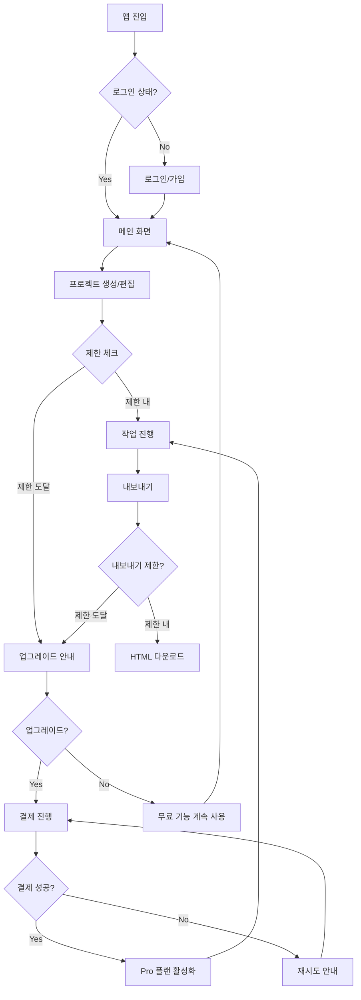
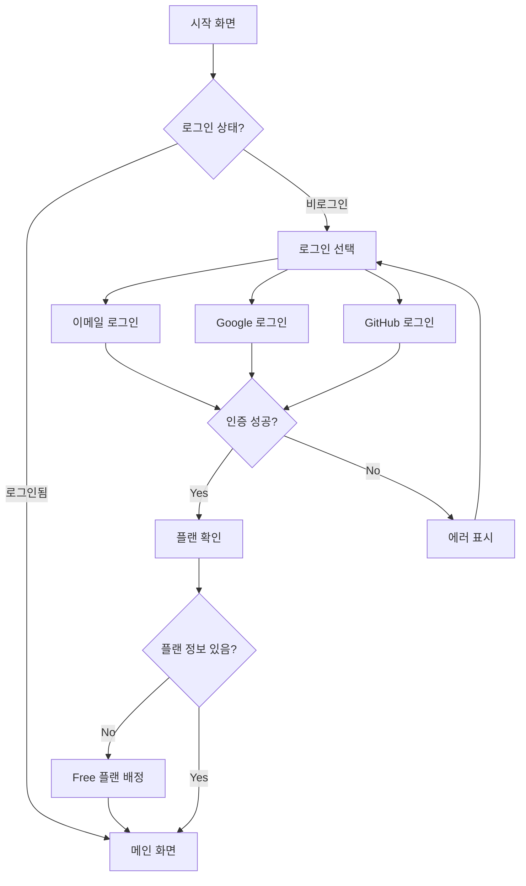
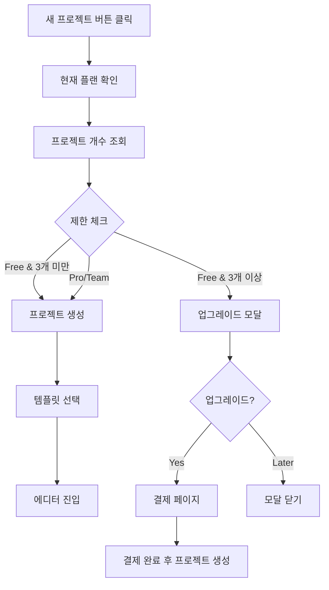
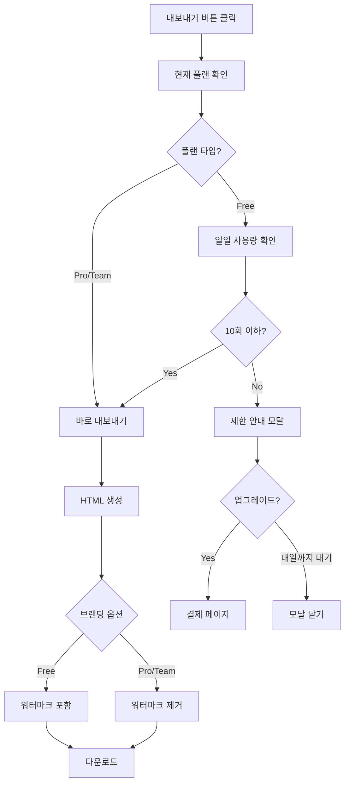
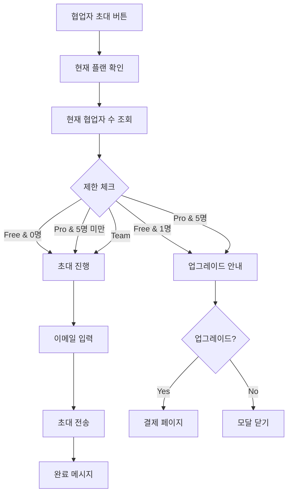
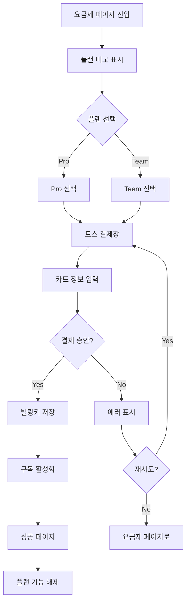
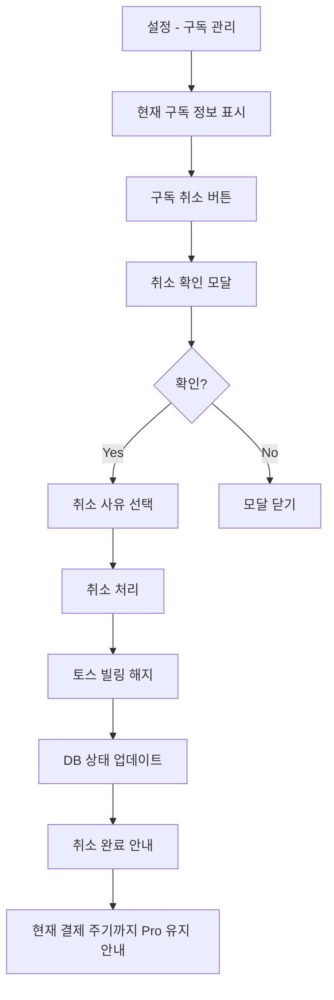
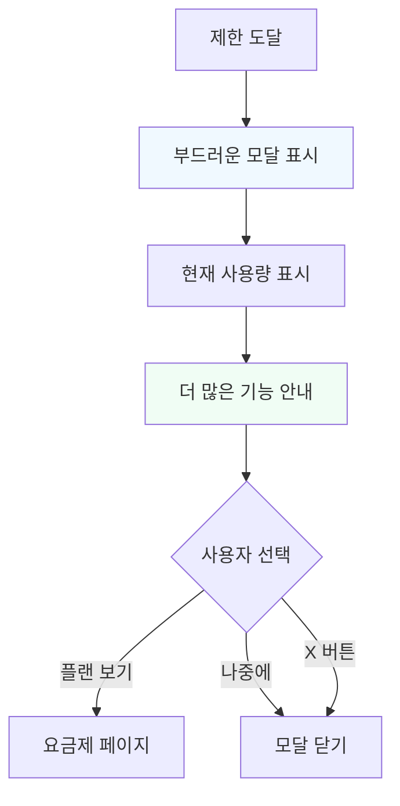
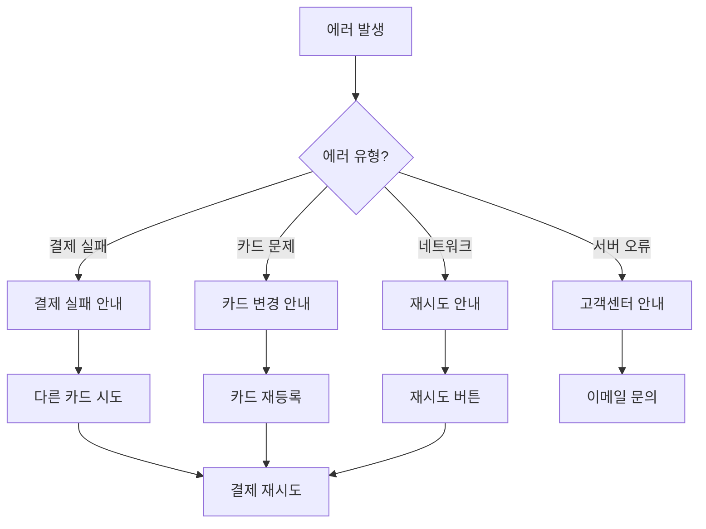

# User Flow (사용자 흐름도)

> StoryFlow Creator 수익화 기능 - 사용자 여정

---

## MVP 캡슐

| # | 항목 | 내용 |
|---|------|------|
| 1 | 목표 | 지속 가능한 서비스 운영을 위한 수익화 기능 구현 |
| 2 | 페르소나 | 간단한 개인 페이지가 필요한 누구나 |
| 3 | 핵심 기능 | FEAT-1: 플랜별 기능 제한 시스템 |
| 4 | 성공 지표 (노스스타) | 월 유료 구독자 수 |
| 5 | 입력 지표 | 무료→유료 전환율, 플랜 업그레이드 클릭 수 |
| 6 | 비기능 요구 | 결제 처리 응답 시간 < 3초 |
| 7 | Out-of-scope | 커스텀 도메인 연결, 연간 결제 |
| 8 | Top 리스크 | 무료 사용자 이탈 |
| 9 | 완화/실험 | Notion 스타일의 관대한 무료 플랜 유지 |
| 10 | 다음 단계 | 플랜 제한 시스템 구현 |

---

## 1. 전체 사용자 여정 (Overview)



---

## 2. FEAT-0: 기존 인증 플로우 (변경 없음)



---

## 3. FEAT-1: 플랜 제한 체크 플로우

### 3.1 프로젝트 생성 제한



### 3.2 내보내기 제한 (기존 로직 확장)



### 3.3 협업자 초대 제한



---

## 4. FEAT-2: 결제 플로우 (v2)

### 4.1 구독 시작



### 4.2 구독 취소



---

## 5. 업그레이드 안내 UI 플로우

### 5.1 제한 도달 시 안내 (비공격적)



**UI 원칙:**
- 강제 팝업 없음 (사용자가 X로 닫을 수 있음)
- 담백한 톤 ("더 많은 기능이 필요하신가요?")
- 현재 사용량 시각화
- "나중에" 버튼 항상 제공

---

## 6. 에러 처리 플로우



---

## 7. 화면 목록 (Screen Inventory)

| 화면 ID | 화면명 | FEAT | 진입점 | 주요 액션 |
|---------|--------|------|--------|----------|
| S-01 | 메인 화면 | 기존 | 로그인 후 | 프로젝트 목록 |
| S-02 | 프로젝트 에디터 | 기존 | S-01 | 섹션 편집 |
| S-03 | 요금제 페이지 | FEAT-1 | 헤더/제한 모달 | 플랜 비교, 결제 |
| S-04 | 제한 안내 모달 | FEAT-1 | 제한 도달 시 | 업그레이드 유도 |
| S-05 | 결제 완료 | FEAT-2 | S-03 | 성공 확인 |
| S-06 | 구독 관리 | FEAT-2 | 설정 | 플랜 변경/취소 |
| S-07 | 결제 내역 | FEAT-2 | S-06 | 내역 확인 |

---

## 8. 플랜 상태 표시 UI

### 8.1 헤더 표시

```
┌─────────────────────────────────────────────────────────────┐
│  StoryFlow    [프로젝트] [템플릿]         [Free ▼]  [👤]    │
└─────────────────────────────────────────────────────────────┘
                                             ↑
                                    현재 플랜 배지
                                    클릭 시 요금제 페이지
```

### 8.2 사용량 표시 (대시보드)

```
┌─────────────────────────────────────────────────────────────┐
│  📊 사용량                                                   │
├─────────────────────────────────────────────────────────────┤
│  프로젝트    ████████░░  2/3                                 │
│  오늘 내보내기  ██████░░░░  6/10                              │
│  협업자      ██████████  1/1                                 │
│                                                             │
│  [더 많은 기능이 필요하신가요? →]                              │
└─────────────────────────────────────────────────────────────┘
```

---

## Decision Log

| # | 결정 | 이유 |
|---|------|------|
| D1 | 제한 도달 시 작업 중단 없음 | UX 유지 (저장/편집은 가능) |
| D2 | 비공격적 모달 | 공격적 업셀 회피 |
| D3 | "나중에" 버튼 필수 | 사용자 선택권 존중 |
| D4 | 현재 주기 끝까지 Pro 유지 | 취소해도 불이익 없음 |
