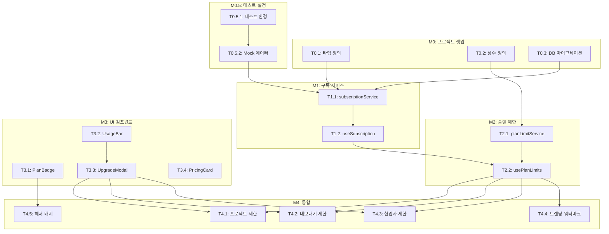

# TASKS: StoryFlow Creator 수익화 기능 - AI 개발 파트너용 태스크 목록

## MVP 캡슐

| # | 항목 | 내용 |
|---|------|------|
| 1 | 목표 | 지속 가능한 서비스 운영을 위한 수익화 기능 구현 |
| 2 | 페르소나 | 간단한 개인 페이지가 필요한 누구나 |
| 3 | 핵심 기능 | FEAT-1: 플랜별 기능 제한 시스템 |
| 4 | 성공 지표 (노스스타) | 월 유료 구독자 수 |
| 5 | 입력 지표 | 무료→유료 전환율, 플랜 업그레이드 클릭 수 |
| 6 | 비기능 요구 | 결제 처리 응답 시간 < 3초 |
| 7 | Out-of-scope | 커스텀 도메인 연결, 연간 결제 |
| 8 | Top 리스크 | 무료 사용자 이탈 (공격적 업셀 시) |
| 9 | 완화/실험 | Notion 스타일의 관대한 무료 플랜 유지 |
| 10 | 다음 단계 | 플랜 제한 시스템 구현 |

---

## 마일스톤 개요

| 마일스톤 | 설명 | Phase | 주요 기능 |
|----------|------|-------|----------|
| M0 | 프로젝트 셋업 | Phase 0 | 타입 정의, 상수 설정 |
| M0.5 | 테스트 & Mock 설정 | Phase 0 | 테스트 환경, Mock 데이터 |
| M1 | 구독 서비스 구현 | Phase 1 | subscriptionService, 훅 |
| M2 | 플랜 제한 시스템 | Phase 2 | planLimitService, 제한 체크 |
| M3 | UI 컴포넌트 | Phase 3 | 모달, 배지, 사용량 바 |
| M4 | 통합 & 적용 | Phase 4 | 기존 컴포넌트에 제한 적용 |

---

## M0: 프로젝트 셋업

### [] Phase 0, T0.1: 구독 관련 타입 정의

**담당**: frontend-specialist

**작업 내용**:
- `types/subscription.ts` 파일 생성
- PlanType, SubscriptionStatus 타입 정의
- PlanLimits, Subscription, Usage 인터페이스 정의
- SubscriptionWithUsage 통합 타입 정의

**산출물**:
- `types/subscription.ts`

**참조**: 07-coding-convention.md 섹션 4

**완료 조건**:
- [ ] TypeScript 에러 없음 (`npx tsc --noEmit`)
- [ ] 기존 types.ts와 일관된 스타일

---

### [] Phase 0, T0.2: 플랜 제한 상수 정의

**담당**: frontend-specialist

**작업 내용**:
- `services/planLimitService.ts` 파일 생성
- PLAN_LIMITS 상수 정의 (free/pro/team)
- PLAN_PRICES 상수 정의
- 헬퍼 함수 시그니처 정의

**산출물**:
- `services/planLimitService.ts`

**참조**: 02-trd.md 섹션 5.3

**완료 조건**:
- [ ] 모든 플랜 (free, pro, team) 제한 정의됨
- [ ] 가격 정보 포함 (0, 9900, 29900)

---

### [] Phase 0, T0.3: Supabase 마이그레이션 SQL 작성

**담당**: database-specialist

**작업 내용**:
- `supabase/migrations/` 폴더에 SQL 파일 생성
- subscriptions 테이블 생성
- payment_history 테이블 생성
- usage_logs 테이블 생성
- RLS 정책 설정
- 트리거 함수 생성

**산출물**:
- `supabase/migrations/20240101_create_subscription_tables.sql`

**참조**: 04-database-design.md 섹션 5

**완료 조건**:
- [ ] 모든 테이블 정의됨
- [ ] RLS 정책 포함
- [ ] 트리거 함수 포함
- [ ] 기존 사용자 Free 플랜 배정 쿼리 포함

---

## M0.5: 테스트 & Mock 설정

### [] Phase 0, T0.5.1: 테스트 환경 설정

**담당**: test-specialist

**작업 내용**:
- Vitest 설정 확인/추가
- React Testing Library 설정
- Supabase Mock 설정
- 테스트 폴더 구조 생성

**산출물**:
- `vitest.config.ts` (수정 또는 확인)
- `src/__tests__/setup.ts`

**완료 조건**:
- [ ] `npm run test` 명령어 동작
- [ ] Supabase 클라이언트 Mock 가능

---

### [] Phase 0, T0.5.2: 구독 Mock 데이터 생성

**담당**: test-specialist

**작업 내용**:
- `src/mocks/subscriptionMock.ts` 생성
- 각 플랜별 Mock 구독 데이터
- Mock 사용량 데이터
- Supabase 응답 Mock 함수

**산출물**:
- `src/mocks/subscriptionMock.ts`

**Mock 데이터 예시**:
```typescript
export const mockFreeSubscription = {
  id: 'mock-sub-1',
  user_id: 'mock-user-1',
  plan_type: 'free',
  status: 'active',
  // ...
};
```

**완료 조건**:
- [ ] free/pro/team 각 플랜별 Mock 데이터
- [ ] 사용량 Mock 데이터 (제한 도달/미도달 케이스)

---

## M1: 구독 서비스 구현

### [] Phase 1, T1.1: subscriptionService 구현 RED→GREEN

**담당**: frontend-specialist

**Git Worktree 설정**:
```bash
# 1. Worktree 생성
git worktree add ../storyflow-phase1-subscription -b phase/1-subscription
cd ../storyflow-phase1-subscription

# 2. 작업 완료 후 병합 (사용자 승인 필요)
# git checkout main
# git merge phase/1-subscription
# git worktree remove ../storyflow-phase1-subscription
```

**TDD 사이클**:

1. **RED**: 테스트 작성 (실패 확인)
   ```bash
   # 테스트 파일: src/__tests__/services/subscriptionService.test.ts
   npm run test -- src/__tests__/services/subscriptionService.test.ts
   # Expected: FAILED (구현 없음)
   ```

2. **GREEN**: 최소 구현 (테스트 통과)
   ```bash
   # 구현 파일: services/subscriptionService.ts
   npm run test -- src/__tests__/services/subscriptionService.test.ts
   # Expected: PASSED
   ```

3. **REFACTOR**: 리팩토링 (테스트 유지)
   - 에러 핸들링 개선
   - 타입 안전성 강화

**산출물**:
- `src/__tests__/services/subscriptionService.test.ts` (테스트)
- `services/subscriptionService.ts` (구현)

**구현할 함수**:
- `getSubscription()`: 현재 구독 정보 조회
- `getUsage(userId)`: 사용량 조회
- `getSubscriptionWithUsage()`: 통합 조회

**인수 조건**:
- [ ] 테스트 먼저 작성됨 (RED 확인)
- [ ] 모든 테스트 통과 (GREEN)
- [ ] Supabase 연동 동작

**완료 시**:
- [ ] 사용자 승인 후 main 브랜치에 병합
- [ ] worktree 정리: `git worktree remove ../storyflow-phase1-subscription`

---

### [] Phase 1, T1.2: useSubscription 훅 구현 RED→GREEN

**담당**: frontend-specialist

**Git Worktree 설정**:
```bash
git worktree add ../storyflow-phase1-hook -b phase/1-hook
cd ../storyflow-phase1-hook
```

**의존성**: T1.1 (subscriptionService) - **Mock 사용으로 독립 개발 가능**

**Mock 설정**:
```typescript
// Mock subscriptionService
vi.mock('../services/subscriptionService', () => ({
  getSubscriptionWithUsage: vi.fn().mockResolvedValue(mockFreeSubscription),
}));
```

**TDD 사이클**:

1. **RED**: 테스트 작성
   ```bash
   # 테스트 파일: src/__tests__/hooks/useSubscription.test.ts
   npm run test -- src/__tests__/hooks/useSubscription.test.ts
   ```

2. **GREEN**: 구현
   ```bash
   # 구현 파일: hooks/useSubscription.ts
   ```

**산출물**:
- `src/__tests__/hooks/useSubscription.test.ts`
- `hooks/useSubscription.ts`

**인수 조건**:
- [ ] 테스트 먼저 작성됨
- [ ] loading/error/data 상태 관리
- [ ] refetch 함수 제공

---

## M2: 플랜 제한 시스템

### [] Phase 2, T2.1: planLimitService 제한 체크 함수 구현 RED→GREEN

**담당**: frontend-specialist

**Git Worktree 설정**:
```bash
git worktree add ../storyflow-phase2-limit -b phase/2-limit
cd ../storyflow-phase2-limit
```

**TDD 사이클**:

1. **RED**: 테스트 작성
   ```bash
   # 테스트 파일: src/__tests__/services/planLimitService.test.ts
   npm run test -- src/__tests__/services/planLimitService.test.ts
   ```

2. **GREEN**: 구현
   ```bash
   # 구현 파일: services/planLimitService.ts (기존 파일에 추가)
   ```

**구현할 함수**:
- `checkProjectLimit(planType, currentCount)`: 프로젝트 생성 가능 여부
- `checkExportLimit(planType, todayCount)`: 내보내기 가능 여부
- `checkCollaboratorLimit(planType, currentCount)`: 협업자 초대 가능 여부
- `canRemoveBranding(planType)`: 브랜딩 제거 가능 여부

**테스트 케이스**:
```typescript
describe('checkProjectLimit', () => {
  it('free 플랜은 3개 제한', () => {
    expect(checkProjectLimit('free', 2)).toBe(true);
    expect(checkProjectLimit('free', 3)).toBe(false);
  });

  it('pro 플랜은 무제한', () => {
    expect(checkProjectLimit('pro', 100)).toBe(true);
  });
});
```

**산출물**:
- `src/__tests__/services/planLimitService.test.ts`
- `services/planLimitService.ts`

**인수 조건**:
- [ ] 모든 플랜/제한 조합 테스트
- [ ] 경계값 테스트 (2/3, 9/10 등)
- [ ] 테스트 커버리지 >= 90%

---

### [] Phase 2, T2.2: usePlanLimits 훅 구현 RED→GREEN

**담당**: frontend-specialist

**Git Worktree 설정**:
```bash
git worktree add ../storyflow-phase2-hook -b phase/2-hook
cd ../storyflow-phase2-hook
```

**의존성**: T1.2 (useSubscription), T2.1 (planLimitService) - **Mock 사용**

**TDD 사이클**:

1. **RED**: 테스트
   ```bash
   # src/__tests__/hooks/usePlanLimits.test.ts
   ```

2. **GREEN**: 구현
   ```bash
   # hooks/usePlanLimits.ts
   ```

**구현할 함수** (훅 반환값):
- `canCreateProject()`: boolean
- `canExport()`: boolean
- `canInviteCollaborator(count)`: boolean
- `canRemoveBranding()`: boolean
- `subscription`: SubscriptionWithUsage
- `loading`: boolean

**산출물**:
- `src/__tests__/hooks/usePlanLimits.test.ts`
- `hooks/usePlanLimits.ts`

**인수 조건**:
- [ ] 모든 제한 체크 함수 구현
- [ ] 로딩 상태 처리
- [ ] 에러 상태 처리

---

## M3: UI 컴포넌트

### [] Phase 3, T3.1: PlanBadge 컴포넌트 구현 RED→GREEN

**담당**: frontend-specialist

**Git Worktree 설정**:
```bash
git worktree add ../storyflow-phase3-badge -b phase/3-badge
cd ../storyflow-phase3-badge
```

**TDD 사이클**:

1. **RED**: 테스트
   ```bash
   # src/__tests__/components/subscription/PlanBadge.test.tsx
   ```

2. **GREEN**: 구현
   ```bash
   # components/subscription/PlanBadge.tsx
   ```

**Props**:
```typescript
interface PlanBadgeProps {
  planType: PlanType;
  onClick?: () => void;
}
```

**테스트 케이스**:
- Free 플랜 → 회색 배지
- Pro 플랜 → 보라색 배지
- Team 플랜 → 파란색 배지
- 클릭 시 onClick 호출

**참조**: 05-design-system.md 섹션 4.1

**산출물**:
- `src/__tests__/components/subscription/PlanBadge.test.tsx`
- `components/subscription/PlanBadge.tsx`

**인수 조건**:
- [ ] 모든 플랜 스타일 테스트
- [ ] 클릭 이벤트 테스트
- [ ] 스크린샷 비교 (선택)

---

### [] Phase 3, T3.2: UsageBar 컴포넌트 구현 RED→GREEN

**담당**: frontend-specialist

**Git Worktree 설정**:
```bash
git worktree add ../storyflow-phase3-usage -b phase/3-usage
cd ../storyflow-phase3-usage
```

**Props**:
```typescript
interface UsageBarProps {
  used: number;
  limit: number | null;  // null = 무제한
  label: string;
}
```

**테스트 케이스**:
- 0/3 → 0% 채움
- 2/3 → 66% 채움
- 3/3 → 100% 채움 + 경고 색상
- 무제한 → "무제한" 텍스트

**참조**: 05-design-system.md 섹션 4.2

**산출물**:
- `src/__tests__/components/subscription/UsageBar.test.tsx`
- `components/subscription/UsageBar.tsx`

---

### [] Phase 3, T3.3: UpgradeModal 컴포넌트 구현 RED→GREEN

**담당**: frontend-specialist

**Git Worktree 설정**:
```bash
git worktree add ../storyflow-phase3-modal -b phase/3-modal
cd ../storyflow-phase3-modal
```

**Props**:
```typescript
interface UpgradeModalProps {
  isOpen: boolean;
  onClose: () => void;
  limitType: 'project' | 'export' | 'collaborator';
  currentUsage: { used: number; limit: number };
}
```

**테스트 케이스**:
- isOpen=false → 렌더링 안 됨
- X 버튼 클릭 → onClose 호출
- "나중에" 클릭 → onClose 호출
- 배경 클릭 → onClose 호출
- ESC 키 → onClose 호출

**비공격적 UX 원칙**:
- "나중에" 버튼 항상 표시
- 강요하지 않는 문구
- 쉽게 닫을 수 있음

**참조**: 05-design-system.md 섹션 4.3

**산출물**:
- `src/__tests__/components/subscription/UpgradeModal.test.tsx`
- `components/subscription/UpgradeModal.tsx`

**인수 조건**:
- [ ] 모든 닫기 방법 테스트
- [ ] 접근성 (ESC 키)
- [ ] 비공격적 UX 원칙 준수

---

### [] Phase 3, T3.4: PricingCard 컴포넌트 구현 RED→GREEN

**담당**: frontend-specialist

**Git Worktree 설정**:
```bash
git worktree add ../storyflow-phase3-pricing -b phase/3-pricing
cd ../storyflow-phase3-pricing
```

**Props**:
```typescript
interface PricingCardProps {
  planType: PlanType;
  isCurrentPlan: boolean;
  isRecommended?: boolean;
  onSelect: () => void;
}
```

**참조**: 05-design-system.md 섹션 4.4

**산출물**:
- `src/__tests__/components/subscription/PricingCard.test.tsx`
- `components/subscription/PricingCard.tsx`

---

## M4: 통합 & 적용

### [] Phase 4, T4.1: 프로젝트 생성에 제한 체크 적용 RED→GREEN

**담당**: frontend-specialist

**Git Worktree 설정**:
```bash
git worktree add ../storyflow-phase4-project -b phase/4-project
cd ../storyflow-phase4-project
```

**의존성**: T2.2 (usePlanLimits), T3.3 (UpgradeModal)

**작업 내용**:
- `App.tsx` 또는 관련 컴포넌트에서 프로젝트 생성 시 제한 체크
- 제한 도달 시 UpgradeModal 표시
- 기존 사용자 프로젝트는 유지 (grandfather 정책)

**테스트 케이스**:
- Free 플랜 + 3개 미만 → 생성 가능
- Free 플랜 + 3개 이상 → 모달 표시
- Pro 플랜 → 항상 생성 가능

**산출물**:
- `src/__tests__/integration/projectCreation.test.tsx`
- `App.tsx` 수정 또는 새 컴포넌트

**인수 조건**:
- [ ] 제한 체크 동작
- [ ] 모달 표시 동작
- [ ] 기존 프로젝트 유지

---

### [] Phase 4, T4.2: 내보내기에 제한 체크 적용 RED→GREEN

**담당**: frontend-specialist

**Git Worktree 설정**:
```bash
git worktree add ../storyflow-phase4-export -b phase/4-export
cd ../storyflow-phase4-export
```

**작업 내용**:
- 기존 `exportLimitService.ts`와 `usePlanLimits` 통합
- Pro 플랜은 무제한
- Free 플랜은 기존 10회/일 유지

**산출물**:
- `src/__tests__/integration/exportLimit.test.tsx`
- `services/exportService.ts` 수정

---

### [] Phase 4, T4.3: 협업자 초대에 제한 체크 적용 RED→GREEN

**담당**: frontend-specialist

**Git Worktree 설정**:
```bash
git worktree add ../storyflow-phase4-collab -b phase/4-collab
cd ../storyflow-phase4-collab
```

**작업 내용**:
- 협업자 초대 시 제한 체크
- Free: 1명, Pro: 5명, Team: 무제한

**산출물**:
- `src/__tests__/integration/collaboratorInvite.test.tsx`
- `services/collaborationService.ts` 수정

---

### [] Phase 4, T4.4: 내보내기 브랜딩 워터마크 적용 RED→GREEN

**담당**: frontend-specialist

**Git Worktree 설정**:
```bash
git worktree add ../storyflow-phase4-branding -b phase/4-branding
cd ../storyflow-phase4-branding
```

**작업 내용**:
- Free 플랜: "Made with StoryFlow" 푸터 추가
- Pro/Team 플랜: 워터마크 제거

**수정 파일**:
- `services/exportService.ts`의 HTML 생성 로직

**산출물**:
- `src/__tests__/services/exportService.test.ts`
- `services/exportService.ts` 수정

**인수 조건**:
- [ ] Free → 워터마크 포함
- [ ] Pro/Team → 워터마크 없음
- [ ] 기존 내보내기 기능 유지

---

### [] Phase 4, T4.5: 헤더에 플랜 배지 추가 RED→GREEN

**담당**: frontend-specialist

**Git Worktree 설정**:
```bash
git worktree add ../storyflow-phase4-header -b phase/4-header
cd ../storyflow-phase4-header
```

**작업 내용**:
- 헤더 컴포넌트에 PlanBadge 추가
- 클릭 시 요금제 페이지 이동

**산출물**:
- 헤더 컴포넌트 수정
- 요금제 페이지 라우팅

---

## 의존성 그래프



---

## 병렬 실행 가능 태스크

| Phase | 병렬 실행 가능 그룹 | 태스크 |
|-------|-------------------|--------|
| Phase 0 | 그룹 A | T0.1, T0.2, T0.3 (독립적) |
| Phase 0 | 그룹 B | T0.5.1 → T0.5.2 (순차) |
| Phase 1 | 단독 | T1.1 → T1.2 (순차, 의존성) |
| Phase 2 | 그룹 C | T2.1 (독립, Mock 사용 시 병렬 가능) |
| Phase 2 | 그룹 D | T2.2 (T1.2, T2.1 의존, Mock 사용 시 병렬 가능) |
| Phase 3 | 그룹 E | T3.1, T3.2, T3.4 (독립적) |
| Phase 3 | 그룹 F | T3.3 (T3.2 선호, 독립 가능) |
| Phase 4 | 그룹 G | T4.1, T4.2, T4.3, T4.4, T4.5 (Mock 사용 시 병렬) |

**병렬 실행 전략**:
- Phase 0의 모든 태스크를 먼저 완료 (기반 작업)
- Phase 1~2는 Mock을 활용하여 병렬 개발 가능
- Phase 3의 UI 컴포넌트는 독립적으로 병렬 개발
- Phase 4는 모든 의존성 완료 후 진행 (또는 Mock으로 병렬)

---

## 검증 명령어

```bash
# TypeScript 검사
npx tsc --noEmit

# 단위 테스트
npm run test

# 특정 테스트
npm run test -- src/__tests__/services/planLimitService.test.ts

# 커버리지
npm run test -- --coverage

# 린트
npm run lint
```

---

## 완료 체크리스트

### MVP 완료 조건
- [ ] M0: 프로젝트 셋업 완료
- [ ] M0.5: 테스트 환경 구성 완료
- [ ] M1: 구독 서비스 구현 완료
- [ ] M2: 플랜 제한 체크 구현 완료
- [ ] M3: UI 컴포넌트 구현 완료
- [ ] M4: 기존 기능에 제한 적용 완료

### 품질 게이트
- [ ] 모든 테스트 통과
- [ ] TypeScript 에러 없음
- [ ] 린트 통과
- [ ] 테스트 커버리지 >= 80%

### 사용자 경험 검증
- [ ] Free 플랜 사용자가 3개 프로젝트까지 사용 가능
- [ ] 제한 도달 시 비공격적 모달 표시
- [ ] "나중에" 버튼으로 쉽게 닫기 가능
- [ ] 기존 사용자 프로젝트 유지 (grandfather)
